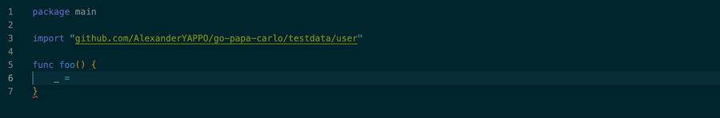

# papa-carlo

The papa-carlo CLI tool is a code generation tool for generating builders with required field enforcement from struct definitions. Generated builders can throw an error during compilation if the code attempts to generate an object without specifying all required fields.

Consider the following struct:
```go
type User struct {
    Name string
    Age int
}
```

If we try to build an instance of `User` with papa-carlo, then both Name and Age must be specified. Otherwise, the code will fail to compile:
```
user = NewUserBuilder().WithName("John").Build() // fails because Age was not specified

user = NewUserBuilder().WithName("John").WithAge(22).Build() // succeeds
```

These builders are also nicely picked up by IntelliSense:


This is made possible by generating a chain of builders where each builder is dedicated to a single required field with only one method `WithX(...)`. The final builder in the chan has method `Build()` which produces the struct itself.

## CLI Usage:

```bash
go-papa-carlo <struct_name> <path_to_struct> [output_path]
```

If `output_path` is omitted, generated code is written next to the input struct file as `<struct_name>_builder_gen.go`. Otherwise, the builde will be generated in the output_path folder.

### Example:

```go
// user.go
package model

type User struct {
	Name string
	Age  int
}
```

```bash
go-papa-carlo User ./model/user.go
```

This generates `./model/User_builder_gen.go` with a builder for `User`.

## Installation

```bash
go install github.com/AlexanderYAPPO/go-papa-carlo@latest
```

Make sure your Go bin directory is on your `PATH` so you can run `go-papa-carlo` from the command line.

## Features:

**Omit** - omit the field so that it won't be mentioned in the builder. Use tag `papa-carlo:"omit"`

```
type OmittableFields struct {
	RequiredInt    int
	OmittableString string `papa-carlo:"omit"`
}

got := pkg1.NewOmittableFieldsBuilder().
    WithRequiredInt(11).
    Build()
```

**Optional** - mark the field as optional so that it's not required to be specified when the builder is used. The optional fields can be specified only at the end of the list (before Build() and after all required fields). Use tag `papa-carlo:"optional"`.
```
type OptionalFields struct {
	RequiredInt    int
	OptString string `papa-carlo:"optional"`
}

got := pkg1.NewStructWithOptionalFieldsBuilder().
    WithRequiredInt(7).
    WithOptionalOptString("hello").
    Build()
```

## Restrictions:

* papa-carlo allows placing builders in packages different from the struct's package. When it happens, the builder cannot work with fields that are private or that use unexported types. Therefore the tool will intentionally fail if such fields are not omitted.

## Why this CLI tool exists:
In Go, when you need to create a struct, there's no nice way to make parameters required. If you create a struct by initializing an object, Go doesn't require you to specify all fields. Therefore, when you add a new field, you cannot make the compiler fail if there are struct initializations that don't specify this field.

This led to the idea of generating builders in such a way that they make it mandatory to specify all required fields.

I explain the reason why this approach could be appealing for some developers in more detail in my [blog](https://yappo.cc/posts/2026-02-16-papa-carlo/)

## Development

### Testing:

Run all tests from the repository root with:

```bash
go test ./...
```

### Coverage:

For coverage that reflects the real behavior of this project, run:

```bash
go test -coverpkg=./... -coverprofile=coverage.out ./...
go tool cover -html=coverage.out
```

The `-coverpkg=./...` flag is required because the main integration test in `e2e/builder_test.go` lives in a dedicated package, but it exercises most of the implementation through imported packages such as `pipeline`, `generate`, and `target`. Without `-coverpkg`, Go records coverage only for the package currently under test, so those imported packages incorrectly appear as uncovered even though the integration test is using them.

This is slightly unorthodox, but it matches how the project is structured: the integration test validates generated code end-to-end while calling into other packages from the top-level test. Note that the nested `go test` executed inside the temporary fixture module is a separate process, so its own coverage is not merged back into the repository coverage report. The outer `go test -coverpkg=./...` command is therefore the best way to measure meaningful coverage for this codebase.
